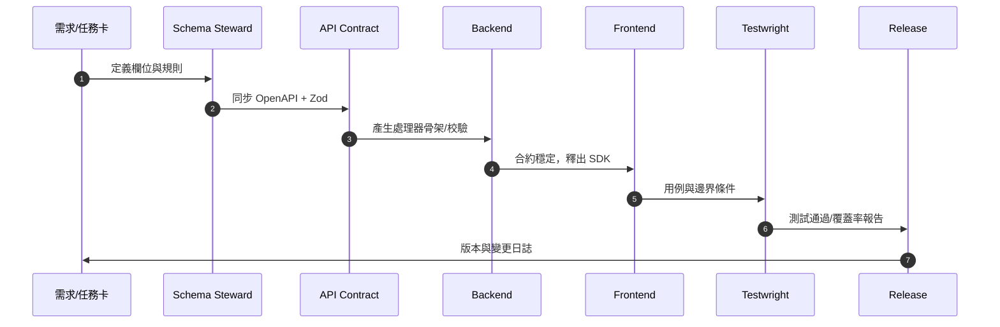

# AGENTS — 智能協作與治理指南

> 目的：為本專案定義一套可重複、可審計、可擴充的「AI 代理（Agents）」協作規範，確保在 **Monorepo（frontend / backend / shared / openapi）** 架構下，所有由人或 AI 產出的程式碼、文件與決策均能遵循 **單一事實來源（SSOT）**、安全與合規要求，並提升交付品質與速度。

---

## 1. 核心原則（Principles）

1. **SSOT**：以 `shared/` 內的 **Zod Schemas** 作為規格唯一來源；任何模型（Mongoose/Prisma）、驗證、DTO、API 文件必須由此推導或保持等價。
2. **小步快跑、可回滾**：所有變更走分支 → PR → CI 驗證 → Code Review → 主幹合併；禁止直接推送至主幹。必要時提供自動化 revert 計畫。
3. **透明可追溯**：每一次 Agent 產出須在 PR 描述中附上：任務說明、輸入資料、決策依據、風險清單、測試證據（coverage/案例連結）。
4. **安全與隱私優先**：不得輸出/上傳任何憑證與個資；敏感設定使用環境變數與密鑰管理；測試/假資料遵循去識別化。
5. **人類在迴圈（HITL）**：任何破壞性/廣泛影響的動作（Schema 變更、資料遷移、Auth/ACL、會計邏輯）必須由人員最終確認。

---

## 2. Monorepo 與邊界（Boundaries）

* **frontend/**：React 18 + TypeScript、MUI v5、Redux Toolkit、RRD v6；僅消費 `openapi/` 產出的型別與 API 客戶端；避免重複定義後端模型。
* **backend/**：Node.js 20 + Express 5；服務協調層 `service/`、領域服務 `services/*`、模型 `models/*`；驗證以 `shared/` schemas 為基準；路由與控制器禁止內聯業務邏輯。
* **shared/**：Zod Schemas、通用型別、工具；**唯一**結構定義來源；對應 OpenAPI 契約。
* **openapi/**：API 規格；自動化生成前端 SDK、伺服器型別與測試樣本；變更需伴隨相容性檢查（SemVer）。

> **邊界原則**：資料結構改動 → 先改 `shared/` 與 `openapi/` → 產生器同步 → backend/ frontend 落地與測試。

---

## 3. 代理類型（Agent Catalog）

下列 Agents 可由人類維運（本地或雲端 LLM/工具）啟動；每個 Agent 的輸出**必須**在 PR 中附帶其「任務卡」內容。

### 3.1 Schema Steward（結構管理）

* **使命**：維護 `shared/` Zod 與 `openapi/` 的一致性；避免結構漂移。
* **輸入**：需求票、領域規則、現有 Schemas、相依模組清單。
* **輸出**：更新後的 Zod/ OpenAPI、破壞性變更清單、遷移建議與測試樣本（valid/invalid）。
* **成功條件**：契約測試通過；前後端型別生成一致；SemVer 影響已標註。
* **禁忌**：跳過相容性檢查；未提供資料遷移策略。

### 3.2 API Contract Enforcer（契約守門）

* **使命**：保證路由/控制器遵循 `openapi/`；自動生成/校驗 handler 標頭、驗證邏輯。
* **輸入**：OpenAPI 規格、現有路由碼、範例請求/回應。
* **輸出**：型別安全的處理器骨架、校驗中介層、契約測試。
* **成功條件**：契約測試 100% 通過；未出現未記載的欄位。

### 3.3 Backend Orchestrator（後端協調）

* **使命**：將控制器 → service（協調）→ services/\*（領域）→ models 的分層實作化，保持 SRP 與可測性。
* **輸入**：用例、資料流程、事件副作用（扣庫存/回補等）。
* **輸出**：服務骨架、交易性處理、回滾策略、單元/整合測試。
* **成功條件**：副作用可重試且具冪等性；錯誤分類與觀測點齊備。

### 3.4 Frontend Builder（前端構建）

* **使命**：以產生之 SDK/型別為基礎，交付可無障礙、可測試的 UI。
* **輸入**：OpenAPI SDK、UI/UX 指南、狀態機需求。
* **輸出**：頁面/元件、RTK Query slices、表單與驗證、E2E 測試。
* **成功條件**：型別零 `any`；表單驗證與 API 契約一致；可無障礙（a11y）檢查通過。

### 3.5 Testwright（測試生成）

* **使命**：產生單元、整合、契約、E2E 測試與測試資料工廠。
* **輸入**：用例矩陣、邊界條件、錯誤分類、樣本 payload。
* **輸出**：測試碼、coverage 報告、最小再現範例（MRE）。
* **成功條件**：關鍵路徑 ≥ 80% 覆蓋；失敗案例可複現。

### 3.6 Migrator（資料與結構遷移）

* **使命**：在 Schema 變更或商業規則更新時，提供安全遷移腳本與回滾計畫。
* **輸入**：舊/新 schema diff、資料量估計、併發/停機條件。
* **輸出**：遷移腳本、驗證查核清單、回滾腳本、監測指標。
* **成功條件**：遷移零資料遺失；一致性校驗通過；有回退路徑。

### 3.7 Release Manager（版本與變更日誌）

* **使命**：依據變更影響自動建議 SemVer；生成變更日誌與升級指南。
* **輸入**：合併 PR、影響矩陣、相依關係。
* **輸出**：版本號、CHANGELOG、升級指南（含破壞性變更）。
* **成功條件**：相依套件同步升版；發佈標籤一致。

### 3.8 Sec\&Compliance Auditor（安全/合規）

* **使命**：檢查密鑰、個資、資安設定、審計日誌與會計稽核需求的最小集合。
* **輸入**：程式碼/設定、依賴樹、審計規範清單。
* **輸出**：風險報告、修補 PR、審計追蹤項。
* **成功條件**：CI 無高風險暴露；敏感資訊零外洩。

### 3.9 Docs Scribe（文件撰寫）

* **使命**：將需求、設計決策、使用指南、故障教戰手冊標準化為 Markdown。
* **輸入**：設計筆記、架構圖、PR 討論。
* **輸出**：README/AGENTS/CONTRIBUTING/PLAYBOOKS 等。
* **成功條件**：可被新進者 1 小時內上手；內含任務卡樣板。

> 可選進階：**Domain Validator**（藥局/會計等領域規則檢核）。此類代理需在 PR 中附「依據來源」與「限制說明」，並預設**不自動合併**。

---

## 4. 端到端工作流程（Cross‑Agent Workflows）

### 4.1 需求 → 契約 → 落地（標準流）

1. **需求立案**（人類/PM）：撰寫「任務卡」與驗收標準。
2. **Schema Steward**：更新 `shared/` Zod 與 `openapi/`；產生 diff 與破壞性變更清單。
3. **API Contract Enforcer**：生成或校驗後端處理器骨架與中介層。
4. **Backend Orchestrator / Frontend Builder**：分工開發；以 SDK 與型別對接。
5. **Testwright**：補齊測試矩陣與資料工廠。
6. **Release Manager**：決定版本、生成變更日誌與升級指南。
7. **Sec\&Compliance**：終檢資安與合規項。



### 4.2 熱修（Hotfix）

* 建立 `hotfix/*` 分支 → 最小修補 + 測試 → Release Manager 產出 **patch** 版 → 回併 `develop/main`。

### 4.3 結構變更與資料遷移

* 必走 **Schema Steward → Migrator → Testwright → HITL 確認**，並在 PR 附 **回滾計畫** 與 **完整驗證步驟**。

---

## 5. 任務卡（Task Card）標準

在 **Issue/PR 描述**中使用下列 YAML 區塊，供人與 Agents 共用：

```yaml
agent_task:
  title: 短敘述（如：銷售退貨流程-契約與後端）
  intent: feature|fix|refactor|docs|chore|security|migration
  modules: [shared, openapi, backend, frontend]
  inputs:
    - 用戶故事/需求要點
    - 現行限制或已知缺陷
  acceptance:
    - 驗收條件 1（可測）
    - 驗收條件 2（可測）
  risk_register:
    - 類型: data|security|ux|perf
      描述: ...
      緩解: ...
  artifacts_required:
    - 測試報告與 coverage 截圖連結
    - 合約變更 diff 與 SemVer 決策
    - 遷移腳本與回滾說明（如適用）
```

---

## 6. 提示（Prompts）與輸出規範

### 6.1 全域系統提示（供所有 Agents）

* 使用 **正式、精煉、可審計** 的輸出；優先使用 **表格/清單/程式碼區塊**。
* 明確標註假設與限制；遇到不確定性，提供最小可行方案與替代路徑。
* 任何 Schema/API 決策須回鏈至 `shared/`/`openapi/` 的變更點。

### 6.2 常用輸出模板

* **設計決策記錄（ADR）**：背景 → 選項 → 決策 → 後果 → 回滾策略。
* **變更影響矩陣**：誰受影響（前端/後端/DB/文件）× 影響程度（低/中/高）。
* **測試矩陣**：正常流/邊界/錯誤/權限/併發/副作用。

---

## 7. 代碼與文件規範（Conventions）

1. **型別與驗證**：以 `shared/` Zod 為準；不得在端點內另起定義；必要時以型別守衛封裝重用。
2. **層次隔離**：`routes → controller → service（協調） → services/*（領域） → models`；單一責任。
3. **錯誤模型**：定義可序列化錯誤結構（code/message/context/traceId）；前端統一對應。
4. **日誌與觀測**：使用結構化日誌（如 pino）與關鍵事件追蹤；為副作用加上 traceId。
5. **提交與分支**：遵循 Conventional Commits（feat/fix/refactor/docs/chore/revert），分支命名 `type/scope-brief`。
6. **PR 檢核**：

   * 有任務卡 YAML；
   * 有測試與報告；
   * 有風險/回滾說明；
   * 有相容性與 SemVer 說明；
   * CI 綠燈。

---

## 8. 常見劇本（Playbooks）

### 8.1 新增欄位（例：`SaleItem.notes` → `note` 對映）

* Schema Steward：更新 `shared/` 與 `openapi/`，提供對映函式（API↔Model）。
* Backend Orchestrator：在 service 層實作對映；補回溯相容處理。
* Frontend Builder：調整表單/型別；補單元測試。
* Testwright：提供舊/新 payload 套件化測資。

### 8.2 新增用例（例：銷售退貨）

* 定義狀態機與副作用（扣庫存/回補/會計分錄）；
* API 與資料結構先行；
* 產生前端 SDK；
* 實作後端交易性處理與冪等鍵；
* 針對併發/重試/回滾撰寫測試。

### 8.3 破壞性 Schema 變更

* 產出遷移腳本 + 回滾；
* 以灰度或雙寫策略降低風險；
* 明確標註 `BREAKING CHANGE:` 與升級步驟。

---

## 9. 安全與合規（最低集合）

* 憑證/密鑰：禁止提交；使用環境變數與密鑰庫；CI 需有秘密掃描。
* 個資：以最小可辨識原則處理；測試資料去識別化。
* 依賴：鎖版本與安全審查；高風險套件不得上線。
* 審計：關鍵操作與金流/庫存副作用需具審計日誌。

---

## 10. 範例：從零到 PR（示意）

**需求**：新增「銷售單折讓」功能（僅限原單、稅額自動重計）。

1. 建立 Issue 與任務卡 → 指派 Schema Steward。
2. 更新 `shared/discount.schema.ts` 與 `openapi/sales.yaml`，產生 diff。
3. API Enforcer 生成/校驗 `POST /sales/{id}/allowance` handler 骨架。
4. Backend Orchestrator 完成協調層與副作用（庫存、會計）。
5. Frontend Builder 新增表單與驗證；串接 SDK。
6. Testwright 補單元/整合/契約/E2E；coverage 報告上傳。
7. Release Manager 標註 `minor` 版本並生成 CHANGELOG。
8. Sec\&Compliance 終檢；人員 HITL 確認；合併。

---

## 11. 貢獻流程（Contribution）

1. 建立分支與任務卡；
2. 執行對應 Agent 的腳本或提示；
3. 提交 PR，附證據與風險；
4. 指派 Reviewer（至少 1 名人類 + 1 類型 Agent 輔助檢核）；
5. CI 綠燈後合併；
6. Release Manager 處理版本與標籤。

---

## 12. 附錄 A：最小提示樣板（可複製）

```yaml
# Agent: Schema Steward
goal: 將銷售退貨需求反映到 shared Zod 與 openapi 並保持一致
context:
  repo_layout: [frontend, backend, shared, openapi]
  ssot: shared/ zod schemas, openapi/
inputs:
  - 用戶故事/欄位規則/驗收標準
deliverables:
  - 變更後的 zod schema、openapi 片段
  - 相容性與 SemVer 說明、破壞性清單
  - 測試樣本（valid/invalid）
constraints:
  - 不得引入與現有模型衝突的別名
  - 必須提供遷移與回滾建議
```

```yaml
# Agent: API Contract Enforcer
goal: 確保路由/控制器完全遵循 openapi
inputs:
  - openapi 規格、現有路由、樣本 payload
deliverables:
  - 型別安全的 handler 骨架與驗證中介層
  - 契約測試（request/response/schema）
```

---

## 13. 附錄 B：檢核清單（PR 用）

* [ ] 具備任務卡 YAML 與 ADR/決策依據
* [ ] `shared/` 與 `openapi/` 已同步、無漂移
* [ ] 產出或更新測試，coverage 報告可追溯
* [ ] 風險清單與回滾策略完備
* [ ] 安全/敏感資訊檢查通過
* [ ] 版本號與 CHANGELOG 更新
