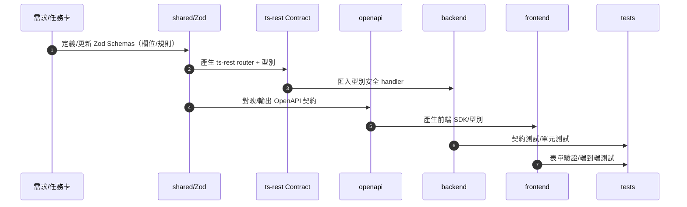

# pharmacy-pos

現代化藥局 POS 生態系：Monorepo

前端 **React 18 + TypeScript**（MUI v5, RTK/RTK Query, React Router v6）

後端 **Node.js 20 + Express 5**

以 **Zod Schemas + OpenAPI** 作為單一事實來源（SSOT），並使用 **pnpm workspace** 維運

[](https://nodejs.org/)
[](https://pnpm.io/)
[](https://www.typescriptlang.org/)
[](LICENSE)

---

## 目錄

* [專案簡介](#專案簡介)
* [核心特色](#核心特色)
* [架構總覽](#架構總覽)
* [資料夾結構](#資料夾結構)
* [快速開始](#快速開始)
* [API 契約與 SSOT 流程](#api-契約與-ssot-流程)
* [品質保證與規範](#品質保證與規範)
* [Agents 與治理](#agents-與治理)
* [貢獻指南](#貢獻指南)
* [安全與隱私](#安全與隱私)
* [版本與發佈](#版本與發佈)
* [路線圖](#路線圖)
* [授權](#授權)
* [附錄：開發小抄](#附錄開發小抄)

---

## 專案簡介

pharmacy-pos 是一套以 Monorepo 方式管理的藥局 POS 生態系，強調**型別一致性**、**契約先行**與**可測試性**。前端與後端均由同一套結構（`shared/` Zod 與 `openapi/` 契約）衍生型別與驗證，降低重工與規格漂移。

## 核心特色

* **ts-rest 契約層**：ts-rest contract 由 shared 契約產生 @ts-rest/express handler 與 @ts-rest/core client，保持前後端型別同步。
* **清晰分層**：`routes → controller → service（協調） → services/*（領域） → models`，提升可維護性與可測試性。
* **型別安全前後端**：前端以 OpenAPI 生成的 client/型別串接 API；表單驗證與後端一致。
* **可觀測與可回滾**：結構化日誌（建議 pino）、錯誤分類、交易性與冪等設計、回滾策略完善。
* **Monorepo 生產力**：pnpm workspace、共用型別、共用工具、集中 Lint/Test/Build。

## 架構總覽



## 資料夾結構

```text
.
├─ frontend/           # React 18 + TS, MUI v5, RTK/RTK Query, React Router v6
├─ backend/            # Node 20 + Express 5, routes/controller/service/models
├─ shared/             # Zod Schemas、共用型別與工具（SSOT）
├─ openapi/            # OpenAPI 規格與生成設定（前端 SDK / 伺服器型別）
├─ .github/            # PR 模板、CI 工作流程（可選）
├─ scripts/            # 產生器與維運腳本（可選）
└─ README.md / AGENTS.md / CONTRIBUTING.md / SECURITY.md / CHANGELOG.md
```

> 備註：若當前倉庫尚未包含 `openapi/` 子模組，請先以 `shared/` 為準進行結構定義，後續再補齊 OpenAPI 並導入生成流程。

## 快速開始

### 1) 先決條件

* Node.js **20.x**
* pnpm **9+**
* MongoDB **6+**（本機或 Docker）

### 2) 取得原始碼與安裝套件

```bash
git clone https://github.com/henry1266/pharmacy-pos.git
cd pharmacy-pos
pnpm install
```

### 3) 設定環境變數

* 建立根目錄 `.env`

### 5) 啟動開發模式

```bash
pnpm run build
pnpm run dev
```

> **安全提示**：請勿提交任何憑證與個資；使用環境變數與密鑰管理。

## API 契約與 SSOT 流程

以 **Zod（shared）** 為唯一規格來源。流程如下：


原則：

* **不得**於路由/控制器中臨時自創驗證結構；應重用 `shared/`。
* OpenAPI 變更需伴隨 **相容性（SemVer）** 說明與 **valid/invalid 測試樣本**。
* 前端表單驗證以 `shared/` schema 或由其衍生的型別/守衛為準。

## 品質保證與規範

* **ESLint + Prettier**：統一程式風格與可讀性。
* **型別檢查**：`pnpm -w run typecheck` 必須通過。
* **測試涵蓋**：關鍵路徑 ≥ **80%**；契約測試全通過。
* **提交規範**：**Conventional Commits**（`feat: ...` / `fix: ...` / `refactor: ...`）。
* **PR 檢核**（最小集合）：

  * 有明確需求與驗收標準；
  * 有測試與報告（或說明不可測原因）；
  * 有風險與回滾策略；
  * SSOT 同步無漂移（shared ↔ openapi ↔ 實作）。

## Agents 與治理

本專案採用 **Agents 治理** 以提升一致性與交付速度。請參閱：[**AGENTS.md**](./AGENTS.md)

**最小任務卡 YAML**（貼於 Issue/PR）：

```yaml
agent_task:
  title: 銷售退貨—契約與後端
  intent: feature
  modules: [shared, openapi, backend, frontend]
  inputs:
    - 用戶故事與欄位規則
  acceptance:
    - API 契約測試全通過
    - 前端表單驗證與後端一致
  risk_register:
    - 類型: data
      描述: 退貨副作用影響庫存
      緩解: 交易性處理 + 冪等鍵
  artifacts_required:
    - coverage 報告連結
    - openapi diff 與 SemVer 決策
    - 遷移/回滾說明（如適用）
```

## 貢獻指南

* 請先閱讀：[**CONTRIBUTING.md**](./CONTRIBUTING.md) 與 [**AGENTS.md**](./AGENTS.md)
* 工作流程：分支 → PR → CI 驗證 → 審閱 → Merge
* 分支命名：`type/scope-brief`（例：`feat/sales-return`）

## 安全與隱私

* 不得提交任何憑證、個資或機敏設定；請使用環境變數與密鑰管理。
* 提交前請執行秘密掃描（CI 可加入 secret scanning）。
* 測試資料需**去識別化**。

詳見：[**SECURITY.md**](./SECURITY.md)

## 版本與發佈

* **SemVer**：破壞性變更 → `major`；新增功能 → `minor`；修補 → `patch`。
* 發佈需同步更新 **CHANGELOG.md**（自動或手動）。
* Hotfix：以 `hotfix/*` 分支處理並回併主幹。

## 路線圖

* [ ] 銷售退貨與折讓流程（交易性/冪等與庫存回補）
* [ ] 會計子系統（雙分錄、報表匯出）
* [ ] 庫存批號/效期與安全庫存警示
* [ ] 使用者/權限（RBAC、稽核軌跡）
* [ ] 前端可觀測性（錯誤上報、使用情境追蹤）

## 授權

本專案採用 **MIT License**。

---

## 附錄：開發小抄

常用指令

```bash
# 安裝依賴（workspaces）
pnpm install -w

# 一鍵開發啟動（如已配置）
pnpm -w run dev

# 產生/預覽 OpenAPI（如已配置）
pnpm --filter @pharmacy-pos/shared run generate:openapi
pnpm --filter @pharmacy-pos/shared run generate:openapi && pnpm -w run openapi:preview

# 品質檢查
pnpm -w run lint
pnpm -w run typecheck
pnpm -w run test

# 建置/啟動
pnpm -w run build
pnpm --filter backend run start
pnpm --filter frontend run preview
```
