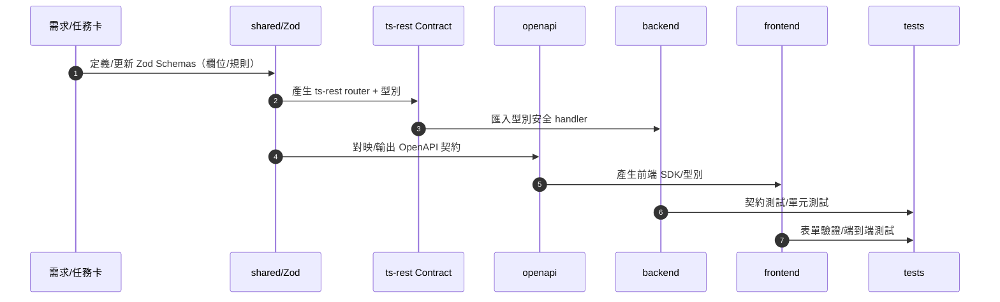

# 藥局 POS 系統 — 後端服務

> Node.js + Express + TypeScript + MongoDB 的藥局 POS 生態系後端。提供庫存、銷售、會計、員工等核心功能，並以 **Zod + OpenAPI** 作為單一事實來源（SSOT），採 **pnpm workspaces** 維運。

---

## 目錄

* [專案概述](#專案概述)
* [專案特色](#專案特色)
* [資料夾結構](#資料夾結構)
* [技術與關聯套件](#技術與關聯套件)
* [快速開始](#快速開始)
* [環境變數](#環境變數)
* [工作區腳本（pnpm）](#工作區腳本pnpm)
* [API 契約與 SSOT 流程](#api-契約與-ssot-流程)
* [品質保證與規範](#品質保證與規範)
* [Agents 與治理](#agents-與治理)
* [貢獻指引](#貢獻指引)
* [安全與隱私](#安全與隱私)
* [版本與發佈](#版本與發佈)
* [路線圖](#路線圖)
* [授權](#授權)

---

## 專案概述

本專案是藥局 POS 系統的後端服務，基於 **Node.js + Express + TypeScript + MongoDB** 構建，提供完整的藥局管理功能，包括 **庫存管理、銷售記錄、會計系統、員工管理** 等核心功能。

### pharmacy-pos — Monorepo

* 前端：React 18 + TypeScript（MUI v5、RTK/RTK Query、React Router v6）
* 後端：Node.js 20 + Express 4
* SSOT：Zod Schemas + OpenAPI
* 套件管理：pnpm workspaces

---

## 專案特色

* **單一事實來源（SSOT）**：`shared/` 中的 **Zod Schemas** 與 `openapi/` 的 **OpenAPI 契約** 為規格唯一來源；**模型、驗證、DTO、前端型別與 SDK** 皆由此推導。
* **明確分層**：`routes → controller → service（協調） → services/*（領域） → models`，可測、可維護。
* **型別安全前後端**：前端以 OpenAPI 生成的 client/型別串接 API；表單驗證與後端一致。
* **可觀測與可回滾**：結構化日誌（建議 **pino**）、錯誤分類、**交易性** 與 **冪等** 設計、提供回滾策略。
* **Monorepo 生產力**：pnpm workspace、共用型別、共用工具、集中 Lint/Test/Build。

---

## 資料夾結構

```text
.
├─ frontend/           # React 18 + TS, MUI v5, RTK/RTK Query, React Router v6
├─ backend/            # Node 20 + Express 4, routes/controller/service/models
├─ shared/             # Zod Schemas、共用型別與工具（SSOT）
├─ openapi/            # OpenAPI 規格與生成設定（前端 SDK / 伺服器型別）
├─ .github/            # PR 模板、CI 工作流程（可選）
├─ scripts/            # 產生器與維運腳本（可選）
└─ README.md / AGENTS.md / CONTRIBUTING.md / SECURITY.md / CHANGELOG.md
```

---

## 技術與關聯套件

* **前端**：React 18、TypeScript 5、MUI v5、Redux Toolkit（含 RTK Query）、React Router v6、Vite
* **後端**：Node.js 20、Express 4、（ODM/ORM 依實況，例如 Mongoose）
* **SSOT**：Zod（`shared/`）、OpenAPI（`openapi/`）
* **開發體驗**：pnpm workspace、ESLint、Prettier、Husky（pre-commit）、commitlint（Conventional Commits）
* **測試**：Vitest / Jest、Testing Library、Playwright / Cypress（E2E，依專案配置）
* **文件**：Swagger UI / Redoc（OpenAPI 預覽）

---

## 快速開始

### 1) 安裝需求

* Node.js **20.x+**
* pnpm **9+**
* MongoDB **6+**（或使用 Docker Compose）
* （可選）Redis / 其他相依服務依專案實況

### 2) 取得原始碼與安裝套件

```bash
git clone https://github.com/henry1266/pharmacy-pos.git
cd pharmacy-pos
pnpm install -w
```

### 3) 設定環境變數

請建立根目錄 `.env`（可選）以及 `backend/.env`、`frontend/.env`。

> 前端需使用 `VITE_` 前綴之環境變數。

### 4) 生成 / 同步 OpenAPI（若有生成腳本）

```bash
pnpm --filter @pharmacy-pos/shared run generate:openapi   # 由 openapi 契約生成前端 SDK / 後端型別
pnpm -w run typecheck     # 確認前後端型別一致
```

### 5) 啟動開發模式

```bash
# 一鍵啟動（如有 workspace 聚合指令）
pnpm -w run dev

# 或分別啟動
pnpm --filter backend run dev
pnpm --filter frontend run dev
```

---

## 環境變數

### workspace root `package.json` 建議

```json
{
  "scripts": {
    "dev": "pnpm -r --parallel --filter frontend --filter backend run dev",
    "build": "pnpm -r run build",
    "lint": "pnpm -r run lint",
    "test": "pnpm -r run test",
    "typecheck": "pnpm -r run typecheck",
    "openapi:gen": "pnpm --filter openapi run gen",
    "openapi:preview": "pnpm --filter openapi run preview"
  }
}
```

### backend/package.json（示意）

```json
{
  "scripts": {
    "dev": "tsx watch src/index.ts",
    "build": "tsc -p tsconfig.build.json",
    "start": "node dist/index.js",
    "lint": "eslint .",
    "test": "vitest run",
    "typecheck": "tsc --noEmit"
  }
}
```

### openapi/package.json（示意）

```json
{
  "scripts": {
    "gen": "openapi-generator-cli generate -c ./generator.config.json",
    "preview": "npx redocly preview-docs ./spec.yaml"
  }
}
```

---

## API 契約與 SSOT 流程

> 以 **Zod（shared）** 與 **OpenAPI（openapi）** 為唯一規格來源，落地流程如下。



### 原則

* 不得在路由/控制器中臨時自創驗證結構；應重用 `shared/`。
* OpenAPI 變更需伴隨 **相容性（SemVer）** 說明與 **測試樣本（valid/invalid）**。
* 前端表單驗證以 `shared/` schema 或由其衍生的型別/守衛為準。

### 進貨模組（purchase-orders）契約提醒

* `PUT /purchase-orders/:id` 以 `updatePurchaseOrderSchema` 為規範，允許僅提交變動欄位，請確認驗證維持與 `shared/` 同步。
* 後端 `modules/purchaseOrders/purchaseOrders.service.ts`、`modules/purchaseOrders/services/validation.service.ts` 皆採用 `PurchaseOrderUpdateRequest`，不得回退為完整載荷。
* 前端或整合呼叫請引用 `shared/services/purchaseOrderApiClient.ts` 所提供的 `updatePurchaseOrder`，沿用同一型別以避免欄位漂移。
* 契約調整後請附上最新的 OpenAPI diff、SemVer 決策與測試證據，以符合 Agents 檢核。

---

## 品質保證與規範

* **ESLint + Prettier**：統一程式風格與可讀性。
* **型別檢查**：`pnpm -w run typecheck` 必須通過。
* **測試涵蓋**：關鍵路徑 ≥ **80%**；契約測試全通過。
* **提交規範**：Conventional Commits（`feat: ...` / `fix: ...` / `refactor: ...`）。

### PR 檢核（最小集合

* 有明確需求與驗收標準；
* 有測試與報告（或說明不可測原因）；
* 有風險與回滾策略；
* **SSOT 同步無漂移**（`shared ↔ openapi ↔ 實作`）。

---

## Agents 與治理

本專案採用 **Agents 治理** 提升一致性與交付速度。請參閱：`AGENTS.md`

### 最小任務卡 YAML（貼於 Issue/PR

```yaml
agent_task:
  title: 銷售退貨—契約與後端
  intent: feature
  modules: [shared, openapi, backend, frontend]
  inputs:
    - 用戶故事與欄位規則
  acceptance:
    - API 契約測試全通過
    - 前端表單驗證與後端一致
  risk_register:
    - 類型: data
      描述: 退貨副作用影響庫存
      緩解: 交易性處理 + 冪等鍵
  artifacts_required:
    - coverage 報告連結
    - openapi diff 與 SemVer 決策
    - 遷移/回滾說明（如適用）
```

---

## 貢獻指引

請先閱讀：`CONTRIBUTING.md` 與 `AGENTS.md`
工作流程：**分支 → PR → CI 驗證 → 審閱 → Merge**

**分支命名**：`type/scope-brief`（例：`feat/sales-return`）

---

## 安全與隱私

* 不得提交任何憑證、個資或機敏設定；使用環境變數與密鑰管理。
* 提交前請執行 **秘密掃描**（CI 可加入 secret scanning）。
* 測試資料需去識別化。
* 詳見：`SECURITY.md`

---

## 版本與發佈

* **SemVer**：破壞性變更 → **major**；新增功能 → **minor**；修補 → **patch**。
* 發佈需同步更新 `CHANGELOG.md`（自動或手動）。
* **Hotfix**：以 `hotfix/*` 分支處理並回併主幹。

---

## 路線圖

* [ ] 銷售退貨與折讓流程（交易性/冪等與庫存回補）
* [ ] 會計子系統（雙分錄、報表匯出）
* [ ] 庫存批號/效期與安全庫存警示
* [ ] 使用者/權限（RBAC、稽核軌跡）
* [ ] 前端可觀測性（錯誤上報、使用情境追蹤）
* [ ] 部署腳本與雲端環境（Docker/Compose 或 K8s）

---

## 授權

本專案採用 **MIT License**。詳見 `LICENSE`。
