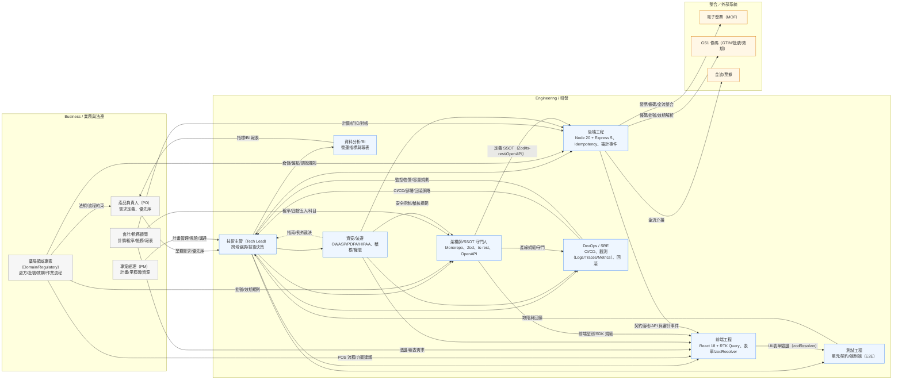
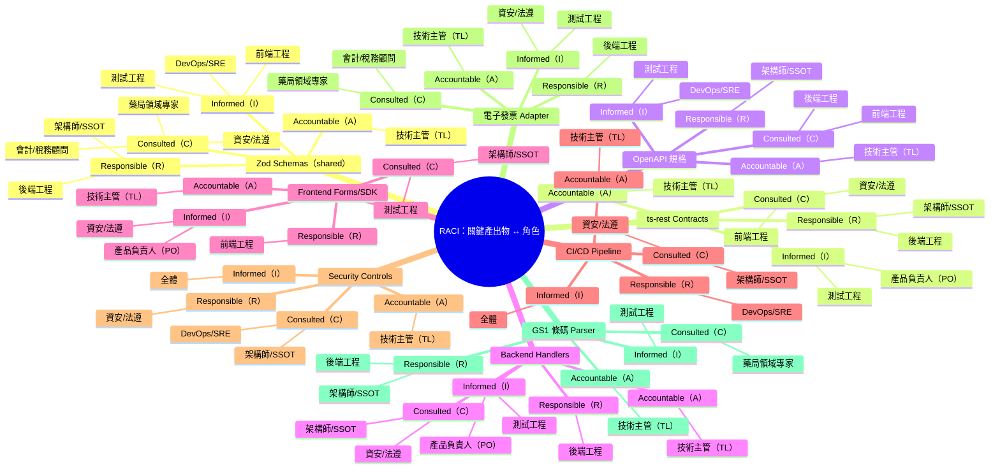
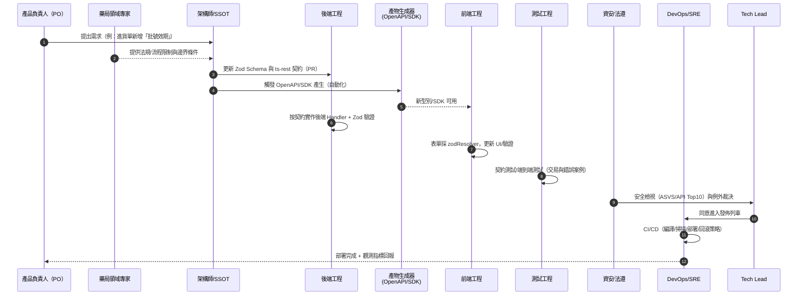

```mermaid

flowchart LR
  %% ====== Business Side ======
  subgraph Business[Business / 業務與法遵]
    PO[產品負責人（PO）\n需求定義、優先序]
    PM[專案經理（PM）\n計畫/里程碑/資源]
    SME[藥局領域專家（Domain/Regulatory）\n處方/批號/效期/作業流程]
    Acct[會計/稅務顧問\n計價/稅率/帳務/報表]
  end

  %% ====== Engineering Side ======
  subgraph Eng[Engineering / 研發]
    TL[技術主管（Tech Lead）\n跨域協調/技術決策]
    Arch[架構師/SSOT 守門人\nMonorepo、Zod、ts-rest、OpenAPI]
    BE[後端工程\nNode 20 + Express 5、Idempotency、審計事件]
    FE[前端工程\nReact 18 + RTK Query、表單/zodResolver]
    QA[測試工程\n單元/契約/端到端（E2E）]
    DevOps[DevOps / SRE\nCI/CD、觀測（Logs/Traces/Metrics）、回滾]
    Sec[資安/法遵\nOWASP/PDPA/HIPAA、稽核/權限]
    Data[資料分析/BI\n營運指標與報表]
  end

  %% ====== Integrations ======
  subgraph Integrations[整合／外部系統]
    EInv[電子發票（MOF）]
    GS1[GS1 條碼（GTIN/批號/效期）]
    Pay[金流/票據]
  end

  %% ====== Relationships ======
  PO -- 業務需求/優先序 --> TL
  PM -- 計畫管理/風險/溝通 --> TL

  TL --> Arch
  TL --> BE
  TL --> FE
  TL --> QA
  TL --> DevOps
  TL --> Sec
  TL --> Data

  SME -- 法規/流程約束 --> PO
  SME -- 批號/效期規則 --> Arch
  SME -- POS 流程/介面建議 --> FE
  SME -- 倉儲/盤點/調撥規則 --> BE

  Acct -- 稅率/四捨五入/科目 --> Arch
  Acct -- 計價/折扣/對帳 --> BE
  Acct -- 憑證/報表需求 --> FE

  Sec -- 安全控制/稽核規範 --> Arch
  Sec --> BE
  Sec --> FE
  Sec --> DevOps
  Sec -. 指南/例外裁決 .-> TL

  Arch -- 定義 SSOT（Zod/ts-rest/OpenAPI） --> BE
  Arch -- 前端型別/SDK 規範 --> FE
  Arch -- 產線規範/守門 --> DevOps

  BE -- 契約落地/API 與審計事件 --> FE
  BE -- 發票/條碼/金流整合 --> EInv
  BE -- 條碼/批號/效期解析 --> GS1
  BE -- 金流介接 --> Pay

  FE -- UI/表單驗證（zodResolver） --> QA
  QA -- 缺陷與回饋 --> TL

  DevOps -- CI/CD/部署/回滾策略 --> TL
  DevOps -- 監控/告警/容量規劃 --> TL
  Data -- 指標/BI 報表 --> PO

  %% Style classes
  classDef business fill:#f6f6f6,stroke:#999999,stroke-width:1px;
  classDef eng fill:#eef6ff,stroke:#3b82f6,stroke-width:1px;
  classDef integ fill:#fff7e6,stroke:#d97706,stroke-width:1px;

  class PO,PM,SME,Acct business;
  class TL,Arch,BE,FE,QA,DevOps,Sec,Data eng;
  class EInv,GS1,Pay integ;

```

```mermaid

mindmap
  root((RACI：關鍵產出物 ↔ 角色))
    Zod Schemas（shared）
      Responsible（R）
        架構師/SSOT
        後端工程
      Accountable（A）
        技術主管（TL）
      Consulted（C）
        資安/法遵
        藥局領域專家
        會計/稅務顧問
      Informed（I）
        前端工程
        測試工程
        DevOps/SRE
    ts-rest Contracts
      Responsible（R）
        架構師/SSOT
        後端工程
      Accountable（A）
        技術主管（TL）
      Consulted（C）
        前端工程
        資安/法遵
      Informed（I）
        測試工程
        產品負責人（PO）
    OpenAPI 規格
      Responsible（R）
        架構師/SSOT
      Accountable（A）
        技術主管（TL）
      Consulted（C）
        後端工程
        前端工程
      Informed（I）
        測試工程
        DevOps/SRE
    Backend Handlers
      Responsible（R）
        後端工程
      Accountable（A）
        技術主管（TL）
      Consulted（C）
        架構師/SSOT
        資安/法遵
      Informed（I）
        測試工程
        產品負責人（PO）
    Frontend Forms/SDK
      Responsible（R）
        前端工程
      Accountable（A）
        技術主管（TL）
      Consulted（C）
        架構師/SSOT
        測試工程
      Informed（I）
        資安/法遵
        產品負責人（PO）
    CI/CD Pipeline
      Responsible（R）
        DevOps/SRE
      Accountable（A）
        技術主管（TL）
      Consulted（C）
        架構師/SSOT
        資安/法遵
      Informed（I）
        全體
    Security Controls
      Responsible（R）
        資安/法遵
      Accountable（A）
        技術主管（TL）
      Consulted（C）
        架構師/SSOT
        DevOps/SRE
      Informed（I）
        全體
    電子發票 Adapter
      Responsible（R）
        後端工程
      Accountable（A）
        技術主管（TL）
      Consulted（C）
        藥局領域專家
        會計/稅務顧問
      Informed（I）
        資安/法遵
        測試工程
    GS1 條碼 Parser
      Responsible（R）
        架構師/SSOT
        後端工程
      Accountable（A）
        技術主管（TL）
      Consulted（C）
        藥局領域專家
      Informed（I）
        測試工程
```

```mermaid

sequenceDiagram
  autonumber
  participant PO as 產品負責人（PO）
  participant SME as 藥局領域專家
  participant Arch as 架構師/SSOT
  participant BE as 後端工程
  participant Gen as 產物生成器<br/>(OpenAPI/SDK)
  participant FE as 前端工程
  participant QA as 測試工程
  participant Sec as 資安/法遵
  participant DevOps as DevOps/SRE
  participant TL as Tech Lead

  PO->>Arch: 提出需求（例：進貨單新增「批號效期」）
  SME-->>Arch: 提供法規/流程限制與邊界條件
  Arch->>BE: 更新 Zod Schema 與 ts-rest 契約（PR）
  Arch->>Gen: 觸發 OpenAPI/SDK 產生（自動化）
  Gen-->>FE: 新型別/SDK 可用
  BE->>BE: 按契約實作後端 Handler + Zod 驗證
  FE->>FE: 表單採 zodResolver，更新 UI/驗證
  QA->>QA: 契約測試/端到端測試（交易與錯誤案例）
  Sec->>TL: 安全檢視（ASVS/API Top10）與例外裁決
  TL->>DevOps: 同意進入發佈列車
  DevOps->>DevOps: CI/CD（編譯/掃描/部署/回滾策略）
  DevOps-->>PO: 部署完成 + 觀測指標回報

```