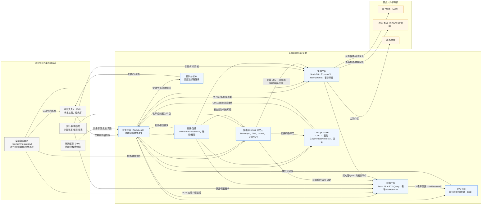

# Release Playbook（範本）

## 任務卡樣板
```yaml
agent_task:
  title: 發行 {version} 套件與標籤
  intent: release
  modules: [shared, openapi, backend, frontend]
  inputs:
    - 最新 schema diff 與 API diff 結果
    - CI 覆蓋率報告連結
  acceptance:
    - 契約測試與單元測試全部通過
    - `docs/CHANGELOG.md` 已更新對應版本資訊
    - 所有子套件版本號已依 SemVer 調整
  risk_register:
    - 類型: perf
      描述: 釋出後可能觸發快取重新暖機
      緩解: 追蹤 APM 指標並於 30 分鐘內確認穩定
  artifacts_required:
    - schema diff 與 openapi diff 結果檔
    - CI 測試報告與 coverage 截圖
    - 標籤訊息（含任務卡摘要與回滾連結）
```

## 操作流程摘要
1. 建立 `release/x.y` 分支並整理 `docs/CHANGELOG.md`。
2. 執行 `pnpm type-check`、契約測試、coverage 收集腳本。
3. 以 Release Manager 任務卡記錄 SemVer 判斷、風險與回滾策略。
4. 通過審查後於 `main` 打 `vX.Y.Z` 標籤，標籤訊息內附任務卡摘要。
5. 建立 LTS 節點時，同步更新支援矩陣與回歸測試列表。

> 注意：若任一自動化腳本無法完成，需在任務卡記錄手動步驟與驗證證據。

## 待開發自動化腳本
| 腳本 | 目的 | 輸入 | 輸出 | 備註 |
| --- | --- | --- | --- | --- |
| `scripts/release/schema-diff.ts` | 比對 `shared` Zod 變更與 OpenAPI 契約 | 上一個標籤、當前 HEAD | markdown/JSON diff，附連結至 PR | 未完成，先由 Schema Steward 手動產生 |
| `scripts/release/version-bump.ts` | 根據 SSOT 變更建議 SemVer | schema diff、API diff 結果 | 建議版本、更新後的 `package.json` 草稿 | 需支援 dry-run 模式 |
| `scripts/release/collect-artifacts.ts` | 集中 CI 產物供標籤佐證 | 測試報告路徑、coverage summary | tarball/zip + 索引檔 | 成功後上傳至發行附件 |
| `scripts/release/verify-lts.ts` | 確認 LTS 覆蓋率與回歸清單 | LTS 測試矩陣、最新測試結果 | 驗證報告、警示清單 | 僅在 LTS 節點執行 |

> 所有腳本需由 Release Manager 維護，並在首次上線前安排 HITL 驗證紀錄。

## 腳本使用示例
```bash
pnpm run release:schema-diff -- --base v1.0.0 --head HEAD
pnpm run release:version-bump -- --schema-diff artifacts/release/schema-diff/schema-diff.json
pnpm run release:collect-artifacts -- --input coverage=backend/coverage/coverage-summary.json --input junit=backend/artifacts/junit.xml
pnpm run release:verify-lts -- --coverage backend/coverage/coverage-summary.json --matrix artifacts/release/lts-matrix.json --require regression,contract
```

## 常見錯誤排除
- `無法取得檔案列表`：確認 `--base` 與 `--head` 參照存在，必要時先 `git fetch --tags`。
- `來源不存在`：檢查 `--input` 指向的檔案是否於 CI 產生，若為目錄需確保先建立。
- `覆蓋率缺少 total 欄位`：請改用 `coverage-summary.json` 或調整測試框架輸出格式。
- `找不到測試套件`：確認 LTS 測試矩陣 JSON 中是否包含對應名稱，必要時更新 `--require` 名稱與矩陣同步。

## CI 流程補充
- **Release Tooling Workflow**：拉 PR 時自動執行 `release:schema-diff` 與 `release:version-bump`，並將輸出上傳為 `release-artifacts`。
- **摘要紀錄**：工作完成後會在 GitHub PR Summary 中附上 schema diff 與版本建議檔案路徑，Reviewer 可直接下載。
- **覆蓋率/LTS**：若需要 coverage 與 LTS 驗證，可在 workflow_dispatch 觸發時加上 `release:collect-artifacts` 與 `release:verify-lts` 步驟，並依任務卡更新需求。

> 請在 PR 任務卡中附上 workflow run 連結，確保審計可追溯。
## 範例輸入檔
- coverage summary：`docs/examples/release/coverage-summary.example.json`
- LTS 測試矩陣：`docs/examples/release/lts-matrix.example.json`

執行範例：
```bash
pnpm run release:collect-artifacts -- \
  --input coverage=docs/examples/release/coverage-summary.example.json \
  --input lts=docs/examples/release/lts-matrix.example.json \
  --output artifacts/release/examples

pnpm run release:verify-lts -- \
  --coverage docs/examples/release/coverage-summary.example.json \
  --matrix docs/examples/release/lts-matrix.example.json \
  --min-coverage 0.8 \
  --require regression,contract
```

> 在 CI 中可先以這份示例驗證流程，之後再替換成真實 coverage 與矩陣輸出。
## 全自動流程

使用 pnpm run release:auto 可以串接 type-check、測試、schema diff 與版本建議，並視需要整合 coverage 與 LTS 驗證。

指令範例：
`ash
pnpm run release:auto -- --coverage docs/examples/release/coverage-summary.example.json --matrix docs/examples/release/lts-matrix.example.json --require regression,contract
`

常用參數：
| 參數 | 說明 |
| --- | --- |
| --skip-tests / --skip-type-check | CI 已跑對應流程時可跳過 |
| --skip-collect / --skip-verify | 僅需產出 diff 與版本建議時使用 |
| --output <dir> | 指定輸出資料夾，預設 rtifacts/release/auto |
| --collect label=path | 額外打包指定檔案或目錄 |
| --level <major|minor|patch> | 覆寫版本建議等級 |

> GitHub Actions Release Tooling workflow 已改用 
elease:auto 指令，PR 任務卡請附 workflow run 連結以利審計。


